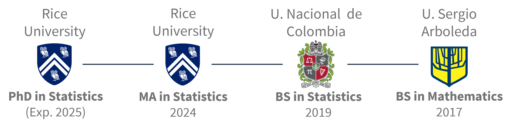
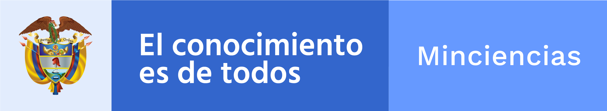

::: justify
## About me

I’m a Data Scientist and Ph.D. graduate in Statistics from **Rice University** under the direction of Dr. [Marina Vannucci](https://marina.blogs.rice.edu/). My work focuses on Bayesian modeling for multivariate and count data, with applications in healthcare, sports, and social science.

I'm currently a Data Scientist at **Amazon**, where I generate analytics and uncover actionable insights for the Speed Transportation Analytics team

When I am not immersed in data and research, I love soccer –watching or playing– as well as exploring new places and taking pictures. Check out some of my travel photos [here](https://mauroflorez.github.io/gallery.html).
:::

::::::: columns
## Research Interests

::: {.column width="30%"}
-   Bayesian Modeling
-   Machine Learning
-   AI
-   Graphical Models
:::

::: {.column width="5%"}
:::

:::: {.column width="60%"}
::: justify
My latest projects involve developing frameworks for estimating graphical models that identify relationships or dependencies between different mixed data types.

A list of projects can be found [here](https://mauroflorez.github.io/projects.html).
:::
::::
:::::::

::: justify
## News

::: {#news-listings}
:::

## Education

{fig-align="center" width="600"}

I completed my undergraduate studies in Bogotá, Colombia, earning a BS in Mathematics from Universidad Sergio Arboleda with a tuition waiver scholarship. I also hold a BS in Statistics from Universidad Nacional de Colombia, where I graduated first in my class. I recently completed a PhD in Statistics at Rice University, where my research focused on Bayesian modeling for complex multivariate and count data.

## Professional Experience

::: {.experience-timeline}

::: {.experience-item}
::: {.experience-logo}

:::
::: {.experience-content}
**Amazon** | 2025 - Present  
*Data Scientist - Speed Analytics*
:::
:::

::: {.experience-item}
::: {.experience-logo}

:::
::: {.experience-content}
**Amazon** | Summer 2025  
*Data Scientist Intern - Community Operations*
:::
:::

::: {.experience-item}
::: {.experience-logo}

:::
::: {.experience-content}
**Rice University** | 2020 - 2025  
*Graduate Research Assistant*
:::
:::

::: {.experience-item}
::: {.experience-logo}

:::
::: {.experience-content}
**Minciencias** | 2019 - 2020  
*Data Scientist*
:::
:::

::: {.experience-item}
::: {.experience-logo}

:::
::: {.experience-content}
**Universidad del Rosario** | 2017 - 2018  
*Data Analyst*
:::
:::

:::

**Lecturer**  
See the full list of courses [here](https://mauroflorez.github.io/teaching.html).
:::

<!--
## MOOCs

-   [Deep Learning](https://www.datacamp.com/completed/statement-of-accomplishment/track/fd6eb135af814741b062bb68c0d8eb1adbd4d76a) **(**2024)\
-   [Developing LLM](https://www.datacamp.com/completed/statement-of-accomplishment/track/3e53de05e5673c349ecd9fb95b143a87891c7217) (2024)\
-   [R Developer](https://www.datacamp.com/completed/statement-of-accomplishment/track/7add30a444c03f094691cc5c2e37aed02b5ee050) (2024)\
-   [Applied Data Science with Python Specialization](https://www.coursera.org/account/accomplishments/specialization/PWJ9L2Z83K5Z) (2019)
-->
